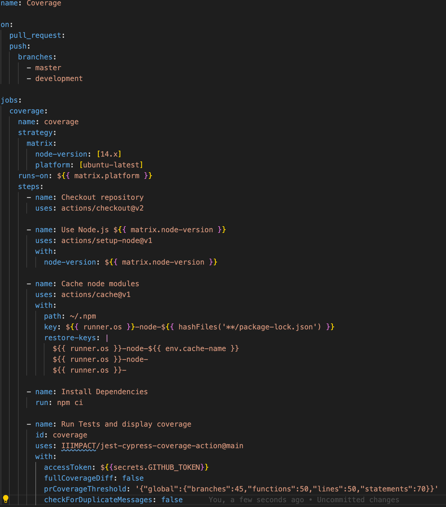
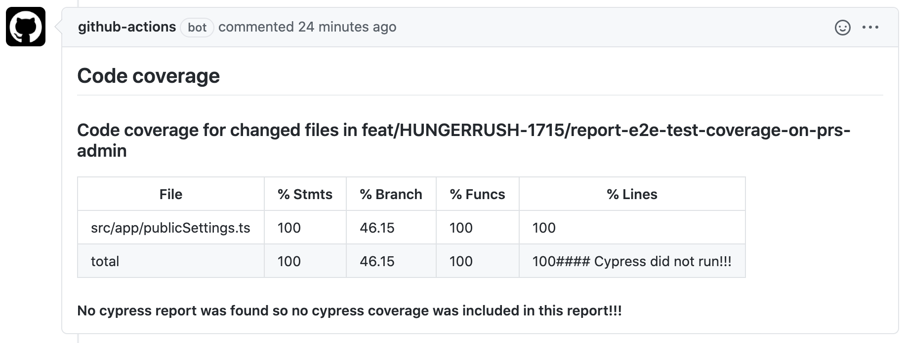
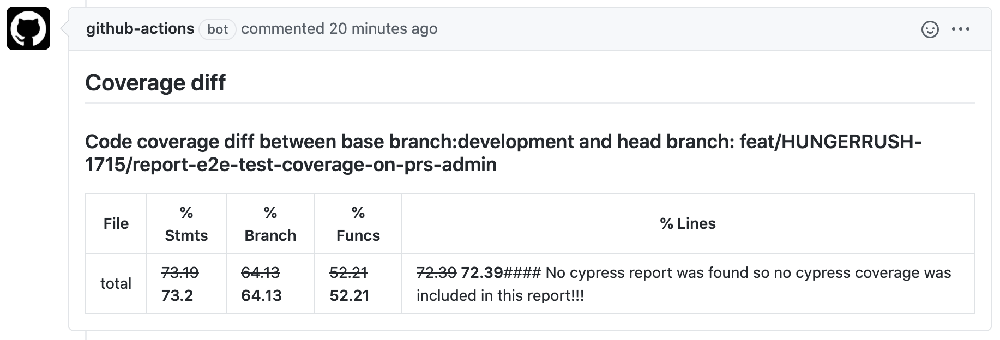

# Get Diff Action

[](https://github.com/technote-space/get-diff-action/actions)
[](https://codecov.io/gh/technote-space/get-diff-action)
[](https://www.codefactor.io/repository/github/technote-space/get-diff-action)
[](https://github.com/technote-space/get-diff-action/blob/master/LICENSE)

GitHub action to merge jest and cypress test coverages.

## Table of Contents

<!-- START doctoc generated TOC please keep comment here to allow auto update -->
<!-- DON'T EDIT THIS SECTION, INSTEAD RE-RUN doctoc TO UPDATE -->
<details>
<summary>Details</summary>

- [Screenshots](#screenshots)
- [Usage](#usage)
  - [Basic Usage](#basic-usage)
- [Behavior](#behavior)
- [Author](#author)

</details>
<!-- END doctoc generated TOC please keep comment here to allow auto update -->

## Screenshots
1. Example workflow

   
2. Coverage result

   
3. Coverage diff

   

## Usage
Basic Usage
```yaml
on:
  pull_request:
  push:
    branches:
      - master
      - development

jobs:
  coverage:
    name: coverage
    strategy:
      matrix:
        node-version: [14.x]
        platform: [ubuntu-latest]
    runs-on: ${{ matrix.platform }}
    steps:
      - name: Checkout repository
        uses: actions/checkout@v2

      - name: Use Node.js ${{ matrix.node-version }}
        uses: actions/setup-node@v1
        with:
          node-version: ${{ matrix.node-version }}

      - name: Cache node modules
        uses: actions/cache@v1
        with:
          path: ~/.npm
          key: ${{ runner.os }}-node-${{ hashFiles('**/package-lock.json') }}
          restore-keys: |
            ${{ runner.os }}-node-${{ env.cache-name }}
            ${{ runner.os }}-node-
            ${{ runner.os }}-

      - name: Install Dependencies
        run: npm ci

      - name: Run Tests and display coverage
        id: coverage
        uses: IIIMPACT/jest-cypress-coverage-action@main
        with:
          accessToken: ${{secrets.GITHUB_TOKEN}}
          fullCoverageDiff: false
          prCoverageThreshold: '{"global":{"branches":45,"functions":50,"lines":50,"statements":70}}'
          checkForDuplicateMessages: false
```

## Behavior
1. Run tests and get combined pr test coverage

   ```run shell scripts
   npm run test:all
   npm run test:cypress:staging
   ```
   =>
   e.g. (default output)
   ```file system
   .nyc_output/out.json
   jest-coverage-full/coverage-final.json
   ```
   =>
   Merge coverage reports
   `merge` will first Normalise jest coverage reports, removing an enclosing `data` property on `*.d.ts` and `*.js` files and then merging the coverages
   ```run shell script to merge coverages
   npm run merge  -- --report ./jest-coverage-full/coverage-final.json --report ./.nyc_output/out.json
   ```
   
3. Test pr coverage against thresholds
   Get list of files that have changed in the pr
   ```fetch the base branch and the head branch and get an array of their diff
   git fetch origin ${branchNameBase}:${branchNameBase}
   git fetch origin ${branchNameHead}:${branchNameHead}
   ```
   =>
   Merge coverage reports
   `merge` will first Normalise jest coverage reports, removing an enclosing `data` property on `*.d.ts` and `*.js` files and then merging the coverages
   ```run shell script to merge coverages
   npm run merge  -- --report ./jest-coverage-full/coverage-final.json --report ./.nyc_output/out.json
   ```
   =>
   Test coverage report summary against the set thresholds

## Author
[GitHub (Jabulani Mpofu)](https://github.com/jabulani404)
